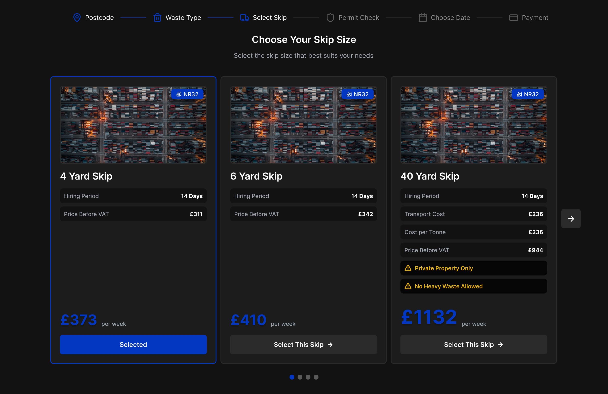

# What is this Repository?

This is a repository which contains the solution to a coding challenge from REMWaste. The rest of the README is for the purpose of explaining how I approached this challenge.

# Organization and Initial Setup
I was asked to re-design the look and feel of a web page while keeping the functionality intact. Usually, I would have a designer working with me who would provide me with updated UI/UX designs. Since I don't have such a designer available, I decided to create a basic mockup in Figma by myself.

https://www.figma.com/design/kBHHO7bdTa7o6Psr0m5txF/REMWaste?node-id=0-1&t=nYqSN2FnNsm8JBNl-1

I decided to follow the same design system which the website was written in, but change some component to make them more appealing (to my eyes, I'm not a designer!). I took note of all the colors, icons, images, and fonts that the website was using. I would need them later when setting up my own project.

I'm using a React-ts-vite-eslint-prettier-tailwindcss boilerplate from "bezlant". This template saves me time by setting up all the libraries and settings that I'm most comforable with. 

To make my life easier in the future, and to write code which can be easily maintained I do the following things:
1. Add the colors to my tailwind.config.js
2. Add ('max-sm', 'max-md', etc) classes in my tailwind.config.js (Sometimes I prefer writing 'max-sm' to indicate if a style should only be applied on 'sm' screens and below.)
3. Add all the icons as TSX SVG assets with good defaults, so I can change their size, color, and add any other classes if desired
4. Change title and favicon, remove default styling
5. Added some initial folders which I will be working in

# Working on the Design
## Header
It would not make any sense to change the styling of the header, since all the other pages share it. I decided to make the header responsive (which it was not in the previous design) by making the progress line change width and make the text dissapear on certain screen sizes. I also made sure that the progress line is blue up to the current active step, which it was not before. 

I made the header component accept an array of objects which contain an icon and a name, as well as the current active index. This way, the header component could be reused on other parts of the website if desired by simply changing the array of icons and names. Passing the current active index will automatically "light up" the steps.

> I'm using basic `assert()` statements in the beginning of some function (preconditions) to formalize the assumptions and easily catch errors while coding.

